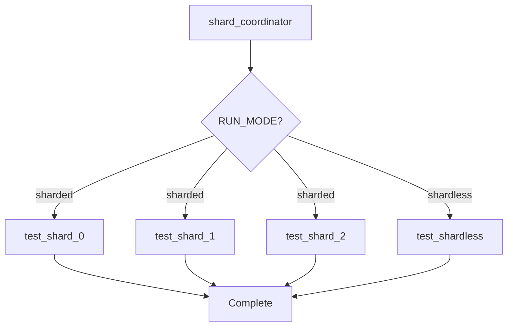

# Graph Pipeline Guide: Dynamic Sharding in Bitrise

This guide explains the **graph-based pipeline** implementation for Flutter test sharding.

## 📊 Graph Pipeline vs Stage Pipeline

### Stage-Based (Old Approach)
```yaml
stages:
  stage_test_sharded:
    workflows:
    - test_shard_0: {}
    - test_shard_1: {}
    - test_shard_2: {}
    parallelism: 3
```

**Issues:**
- All shard workflows start (even if empty)
- Less explicit dependencies
- Harder to visualize flow

### Graph-Based (New Approach)
```yaml
pipelines:
  flutter_test_pipeline:
    workflows:
      shard_coordinator:
        depends_on: []

      test_shard_0:
        depends_on: [shard_coordinator]
        run_if: |-
          {{
            and
            (enveq "RUN_MODE" "sharded")
            (getenv "SHARD_0_PACKAGES" | ne "")
          }}

      test_shard_1:
        depends_on: [shard_coordinator]
        run_if: |-
          {{
            and
            (enveq "RUN_MODE" "sharded")
            (getenv "SHARD_1_PACKAGES" | ne "")
          }}
```

**Benefits:**
- ✅ Only needed shards run (truly dynamic)
- ✅ Explicit dependency graph
- ✅ Better Bitrise UI visualization
- ✅ Automatic parallelism (no explicit setting needed)
- ✅ More efficient resource usage

## 🎯 How It Works

### 1. Dependency Graph



### 2. Dynamic Execution

**Scenario 1: Small change (2 packages)**
```
shard_coordinator calculates:
  RUN_MODE=shardless
  ALL_PACKAGES=feature_a,feature_b

Bitrise executes:
  ✅ shard_coordinator
  ✅ test_shardless (run_if passes)
  ⏭️ test_shard_* (run_if fails - skipped entirely)
```

**Scenario 2: Large change (6 packages → 3 shards)**
```
shard_coordinator calculates:
  RUN_MODE=sharded
  SHARD_0_PACKAGES=feature_a,feature_b
  SHARD_1_PACKAGES=feature_c,feature_d
  SHARD_2_PACKAGES=feature_e,feature_f
  SHARD_COUNT=3

Bitrise executes:
  ✅ shard_coordinator
  ⏭️ test_shardless (run_if fails)
  ✅ test_shard_0 (run_if passes, has packages) ┐
  ✅ test_shard_1 (run_if passes, has packages) ├─ In Parallel
  ✅ test_shard_2 (run_if passes, has packages) ┘
  ⏭️ test_shard_3 (run_if fails, no SHARD_3_PACKAGES)
  ⏭️ test_shard_4 (run_if fails, no SHARD_4_PACKAGES)
```

**Key**: Only 3 shards actually run! test_shard_3 and test_shard_4 are skipped entirely.

## 🔑 Key Components

### 1. Conditional Execution

```yaml
run_if: |-
  {{
    and
    (enveq "RUN_MODE" "sharded")
    (getenv "SHARD_0_PACKAGES" | ne "")
  }}
```

**Explanation:**
- `enveq "RUN_MODE" "sharded"` - Must be in sharded mode
- `getenv "SHARD_0_PACKAGES" | ne ""` - Must have packages assigned
- `and` - Both conditions must be true

This ensures the workflow **only runs if there are actual packages to test**.

### 2. Shared Worker Pattern

Instead of duplicating code across shard workflows:

```yaml
workflows:
  # Generic worker that does the actual work
  test_shard_worker:
    steps:
    - script@1:
        inputs:
        - content: |-
            PACKAGES_VAR="SHARD_${SHARD_INDEX}_PACKAGES"
            PACKAGES="${!PACKAGES_VAR}"
            # ... run tests ...

  # Lightweight wrappers that set SHARD_INDEX
  test_shard_0:
    envs:
    - SHARD_INDEX: "0"
    after_run:
    - test_shard_worker

  test_shard_1:
    envs:
    - SHARD_INDEX: "1"
    after_run:
    - test_shard_worker
```

**Benefits:**
- DRY (Don't Repeat Yourself)
- Single source of truth for test logic
- Easy to add more shards
- Consistent behavior across all shards

### 3. Environment Variable Caching

```yaml
- cache-push@2:
    inputs:
    - cache_paths: /tmp/shard_env.txt
    - cache_key: shard-config-{{ .BuildNumber }}
```

**Why?**
- `shard_coordinator` calculates shard assignments
- Shard workflows run in separate VMs
- Need to share environment variables between them
- Bitrise cache transfers the configuration

**Flow:**
1. Coordinator: Calculate → Export to file → Push to cache
2. Shard workers: Pull from cache → Import environment vars → Run tests

## 🚀 Advantages Over Jenkins

| Feature | Jenkins | Bitrise Graph Pipeline |
|---------|---------|------------------------|
| Dynamic stages | ✅ Yes (Groovy runtime) | ✅ Yes (run_if conditions) |
| Parallel execution | `parallel {}` block | Automatic (when depends_on same parent) |
| Skip empty workers | ✅ Not created | ✅ Skipped via run_if |
| Dependency declaration | Implicit (code flow) | ✅ Explicit (depends_on) |
| Visual representation | OK | ✅ Excellent (graph view) |
| Resource efficiency | Good | ✅ Better (truly skip unused workflows) |

## 📈 Performance Comparison

### Old Stage-Based Approach
```
feature_a modified (+ feature_b, feature_c dependents = 3 packages)

Stage 1: shard_coordinator (30s)
Stage 2: test_shardless (90s)
Stage 3: [skipped but evaluated]
  - test_shard_0 starts → checks packages → exits (5s wasted)
  - test_shard_1 starts → checks packages → exits (5s wasted)
  - test_shard_2 starts → checks packages → exits (5s wasted)

Total: 30s + 90s + 15s = 135s
```

### New Graph-Based Approach
```
feature_a modified (+ feature_b, feature_c dependents = 3 packages)

shard_coordinator (30s)
  ↓
test_shardless (90s)
[test_shard_* never start - run_if evaluates false]

Total: 30s + 90s = 120s (15s saved)
```

**Savings:**
- 11% faster for skipped workflows
- More significant with more defined shards (5s per unused shard)

## 🔧 Configuration

### Adjust Maximum Shards

```yaml
app:
  envs:
  - MAX_SHARDS: "5"  # Define up to 5 shard workflows
```

Then add more shard workflows:

```yaml
workflows:
  test_shard_5:
    envs:
    - SHARD_INDEX: "5"
    after_run:
    - test_shard_worker

pipelines:
  flutter_test_pipeline:
    workflows:
      # ... existing ...
      test_shard_5:
        depends_on: [shard_coordinator]
        run_if: |-
          {{
            and
            (enveq "RUN_MODE" "sharded")
            (getenv "SHARD_5_PACKAGES" | ne "")
          }}
```

### Optimize Parallelism

Bitrise automatically parallelizes workflows with the same `depends_on`:

```yaml
test_shard_0:
  depends_on: [shard_coordinator]  ┐
test_shard_1:                       ├─ Run in parallel
  depends_on: [shard_coordinator]  │  (same dependency)
test_shard_2:                       ┘
  depends_on: [shard_coordinator]
```

**No explicit `parallelism` setting needed!**

### Adjust Concurrency Limits

Control max parallel workflows at the account/plan level:
- Free plan: 1 concurrent build
- Developer plan: 2 concurrent builds
- Organization plan: 3-10+ concurrent builds

The graph pipeline will automatically use available concurrency.

## 🐛 Debugging

### Check Which Workflows Run

```bash
# In Bitrise build logs, look for:
"Workflow test_shard_2 skipped (run_if condition not met)"
```

### Verify run_if Conditions

```yaml
- script@1:
    title: Debug run_if variables
    inputs:
    - content: |-
        echo "RUN_MODE=$RUN_MODE"
        echo "SHARD_0_PACKAGES=$SHARD_0_PACKAGES"
        echo "SHARD_1_PACKAGES=$SHARD_1_PACKAGES"

        # Test condition manually
        if [ "$RUN_MODE" = "sharded" ] && [ -n "$SHARD_0_PACKAGES" ]; then
          echo "✅ test_shard_0 would run"
        else
          echo "⏭️ test_shard_0 would be skipped"
        fi
```

### Verify Cache Transfer

```bash
# In shard worker workflows:
- script@1:
    title: Verify cache loaded
    inputs:
    - content: |-
        if [ -f /tmp/shard_env.txt ]; then
          echo "✅ Cache loaded successfully"
          cat /tmp/shard_env.txt
        else
          echo "❌ Cache not found!"
          exit 1
        fi
```

## 📚 Related Documentation

- [Bitrise Graph Pipelines](https://docs.bitrise.io/en/bitrise-ci/workflows-and-pipelines/build-pipelines/configuring-a-bitrise-pipeline.html)
- [Bitrise run_if Expressions](https://devcenter.bitrise.io/en/builds/workflows-pipelines-and-builds.html#conditional-workflow-execution)
- [Bitrise Parallelism](https://docs.bitrise.io/en/bitrise-ci/workflows-and-pipelines/build-pipelines/configuring-a-bitrise-pipeline.html#configuring-parallelism)

## 🎓 Best Practices

### ✅ DO

1. **Define More Shards Than Needed**
   - Define 5 shards even if you typically need 3
   - Unused ones won't run (no cost)
   - Handles edge cases with many packages

2. **Use Explicit Conditions**
   - Always check both `RUN_MODE` AND package assignment
   - Prevents accidental execution

3. **Cache Configuration**
   - Use unique cache keys per build
   - Include build number: `shard-config-{{ .BuildNumber }}`

4. **Monitor Performance**
   - Track build times per shard
   - Adjust `PACKAGES_PER_SHARD` if imbalanced

### ❌ DON'T

1. **Don't Skip run_if Checks**
   ```yaml
   # BAD - will always run
   test_shard_0:
     depends_on: [shard_coordinator]

   # GOOD - conditional
   test_shard_0:
     depends_on: [shard_coordinator]
     run_if: '{{ ... }}'
   ```

2. **Don't Hardcode Cache Keys**
   ```yaml
   # BAD - collisions between builds
   - cache_key: shard-config

   # GOOD - unique per build
   - cache_key: shard-config-{{ .BuildNumber }}
   ```

3. **Don't Forget Error Handling**
   ```bash
   # Ensure shard worker fails if packages undefined
   if [ -z "$PACKAGES" ]; then
     echo "No packages assigned"
     exit 0  # Exit successfully (not a failure)
   fi
   ```

## 🚀 Migration Guide

### From Stage-Based to Graph-Based

1. **Backup existing config**
   ```bash
   cp bitrise.yml bitrise-stage-based.yml.backup
   ```

2. **Replace pipeline section**
   ```yaml
   # Remove stages: section
   # Add workflows: to pipelines: with depends_on
   ```

3. **Add run_if conditions**
   - Each shard workflow needs both RUN_MODE and package checks

4. **Add caching**
   - Push config in coordinator
   - Pull config in workers

5. **Test locally**
   ```bash
   bash .ci/scripts/simulate_pipeline.sh
   ```

6. **Deploy and monitor**
   - Check Bitrise build logs
   - Verify only needed shards run
   - Check graph visualization in UI

## 💡 Pro Tips

1. **Visual Debugging**: Use Bitrise UI's graph view to see execution flow
2. **Cache Debugging**: Add debug step to print cache contents
3. **Dry Run**: Test run_if logic with manual environment variables
4. **Balance Shards**: Monitor which shards take longest, rebalance if needed
5. **Future-Proof**: Define more shards than currently needed (e.g., 10) for growth

---

**Ready to use?** Copy `bitrise-graph-pipeline.yml` to `bitrise.yml` and push to your repo!
