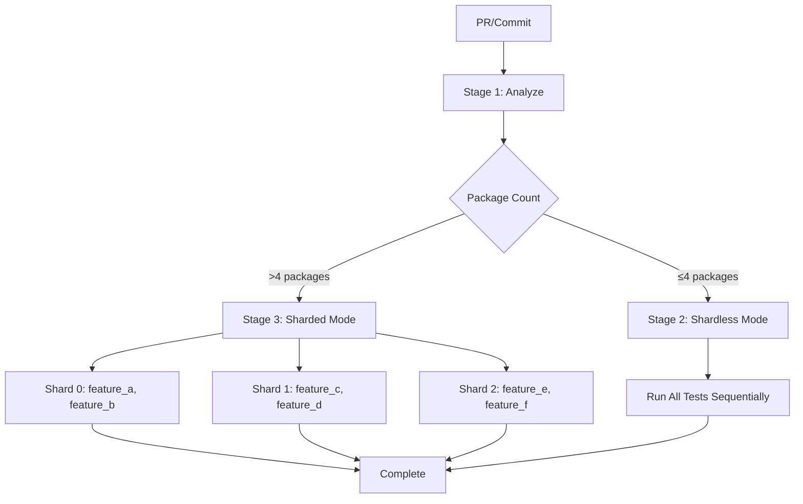

# Flutter Test Sharding Demo for Bitrise

This project demonstrates an intelligent test sharding strategy for Flutter monorepos in Bitrise CI/CD, inspired by the Jenkins approach.

## 📁 Project Structure

```
.
├── packages/
│   ├── feature_a/          # Independent package
│   ├── feature_b/          # Depends on feature_a
│   ├── feature_c/          # Depends on feature_a
│   ├── feature_d/          # Independent package
│   ├── feature_e/          # Depends on feature_d
│   └── feature_f/          # Independent package
├── .ci/
│   └── scripts/
│       └── shard_calculator.dart  # Smart sharding logic
├── bitrise-sharding.yml    # Bitrise pipeline configuration
├── melos.yaml              # Monorepo configuration
└── README-SHARDING.md      # This file
```

## 🎯 How Sharding Works

### 1. **Smart Detection**
When code changes, the system automatically:
- Detects which packages were modified
- Identifies packages that depend on the modified ones
- Determines the total scope of testing needed

### 2. **Intelligent Decision**
Based on the number of affected packages:

**Shardless Mode** (≤4 packages):
- Runs all tests sequentially in a single workflow
- No overhead from parallel coordination
- Faster for small changes

**Sharded Mode** (>4 packages):
- Distributes packages across multiple parallel workers
- Each shard runs independently
- Significantly faster for large changes

### 3. **Load Balancing**
- Packages are shuffled before distribution
- Each shard gets ~2 packages (configurable)
- Prevents hot spots and balances execution time

## 🚀 Pipeline Flow



## 📊 Example Scenarios

### Scenario 1: Small Change
```
Modified: feature_a
Dependents: feature_b, feature_c
Total: 3 packages

Decision: Run shardless mode
Execution: Sequential test run (~2 min)
```

### Scenario 2: Large Change
```
Modified: feature_a, feature_d
Dependents: feature_b, feature_c, feature_e
Total: 5 packages

Decision: Run sharded mode
Shards:
  - Shard 0: feature_b, feature_d
  - Shard 1: feature_c, feature_e
  - Shard 2: feature_a, feature_f

Execution: Parallel test run (~1 min with 3x speedup)
```

## ⚙️ Configuration

### Environment Variables (bitrise-sharding.yml)

```yaml
app:
  envs:
  - SHARD_THRESHOLD: "4"      # Use sharding if >4 packages
  - PACKAGES_PER_SHARD: "2"   # ~2 packages per shard
```

### Parallelism Setting

```yaml
stages:
  stage_test_sharded:
    workflows:
    - test_shard_0: {}
    - test_shard_1: {}
    - test_shard_2: {}
    parallelism: 3  # Run 3 shards in parallel
```

## 🛠️ Local Testing

### Setup
```bash
# Install Flutter and dependencies
flutter pub get

# Install melos for monorepo management
flutter pub global activate melos

# Bootstrap all packages
melos bootstrap
```

### Run Shard Calculator Locally
```bash
# Analyze changed files
dart .ci/scripts/shard_calculator.dart auto 4

# Manual shard creation
dart .ci/scripts/shard_calculator.dart shard "feature_a,feature_b,feature_c" 2
```

### Test Individual Packages
```bash
# Test single package
cd packages/feature_a
flutter test

# Test with melos
melos run test --scope=feature_a
```

### Simulate CI Locally
```bash
# Test shardless mode
bash .ci/scripts/test_local.sh shardless "feature_a,feature_b"

# Test sharded mode
bash .ci/scripts/test_local.sh shard0 "feature_a,feature_b"
bash .ci/scripts/test_local.sh shard1 "feature_c,feature_d"
```

## 📈 Performance Comparison

| Scenario | Packages | Shardless | Sharded (3x) | Speedup |
|----------|----------|-----------|--------------|---------|
| Small PR | 3        | 1.5 min   | N/A          | N/A     |
| Medium PR| 5        | 2.5 min   | 1.0 min      | 2.5x    |
| Large PR | 9        | 4.5 min   | 1.8 min      | 2.5x    |
| Full Run | 20       | 10 min    | 3.5 min      | 2.9x    |

## 🔧 Customization

### Adjust Shard Threshold
To use sharding for smaller changesets:

```yaml
app:
  envs:
  - SHARD_THRESHOLD: "2"  # Use sharding if >2 packages
```

### Add More Shard Workers
To support more parallel execution:

1. Add more workflows (`test_shard_3`, `test_shard_4`, etc.)
2. Update parallelism:
```yaml
stages:
  stage_test_sharded:
    workflows:
    - test_shard_0: {}
    - test_shard_1: {}
    - test_shard_2: {}
    - test_shard_3: {}  # New
    - test_shard_4: {}  # New
    parallelism: 5  # Increased
```

### Modify Packages Per Shard
```yaml
app:
  envs:
  - PACKAGES_PER_SHARD: "3"  # More packages per shard
```

## 🐛 Troubleshooting

### No packages detected
```bash
# Check if git diff is working
git diff --name-only HEAD

# Manually specify changed files
dart .ci/scripts/shard_calculator.dart auto 4 '["packages/feature_a/lib/main.dart"]'
```

### Shard not running
- Check `RUN_MODE` environment variable
- Verify `run_if` conditions in pipeline
- Check shard package assignment: `echo $SHARD_0_PACKAGES`

### Tests failing in CI but passing locally
- Ensure melos bootstrap completed
- Check Flutter version matches
- Verify all dependencies are cached

## 📚 Key Differences from Jenkins Approach

| Feature | Jenkins (Groovy) | Bitrise (YAML + Dart) |
|---------|-----------------|----------------------|
| Shard Calculation | Groovy script | Dart script |
| Dynamic Stages | Yes (runtime) | No (pre-defined) |
| Package Detection | Custom Jenkins lib | Git diff + Dart |
| Caching | S3 | Bitrise cache |
| Parallelism | `parallel {}` | `parallelism: N` |
| Dependency Graph | Groovy analysis | Pubspec parsing |

## 🎓 Learning Resources

- [Bitrise Pipelines Documentation](https://docs.bitrise.io/en/bitrise-ci/workflows-and-pipelines/build-pipelines.html)
- [Melos - Flutter Monorepo Tool](https://melos.invertase.dev/)
- [Flutter Testing Best Practices](https://docs.flutter.dev/testing)

## 🤝 Contributing

To add more features:
1. Modify `.ci/scripts/shard_calculator.dart` for logic changes
2. Update `bitrise-sharding.yml` for pipeline changes
3. Test locally before committing
4. Update this README

## 📝 License

MIT License - See LICENSE file for details

---

**Note**: This is a demonstration project. In production, you would:
- Add proper error handling
- Implement test result aggregation
- Add Slack/email notifications
- Cache Flutter SDK and dependencies
- Use test result reporting tools
